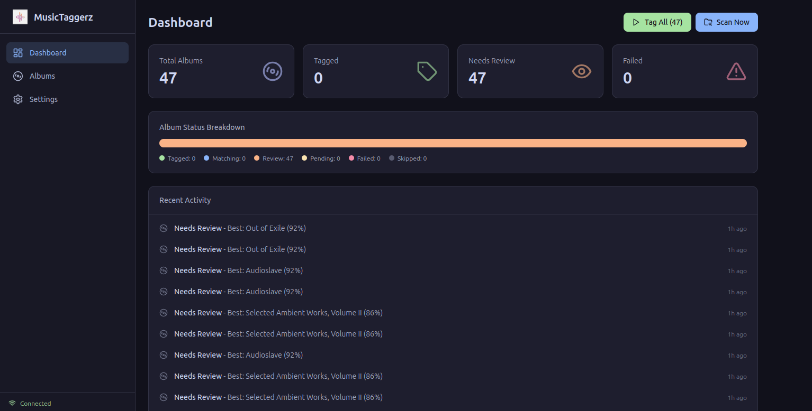
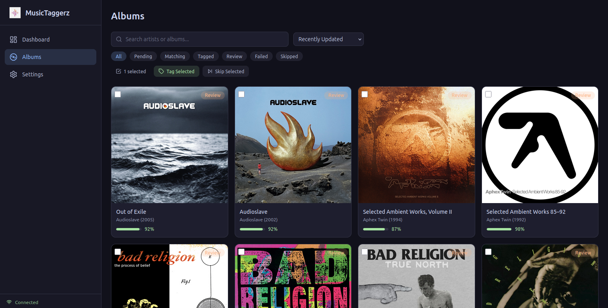
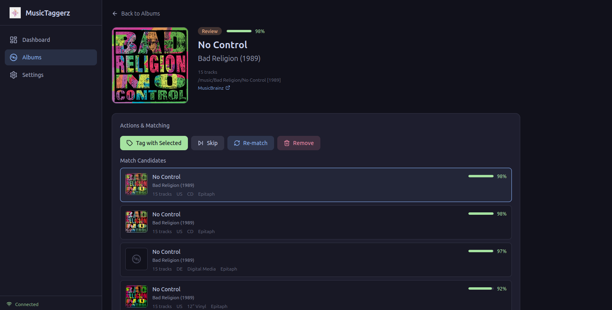
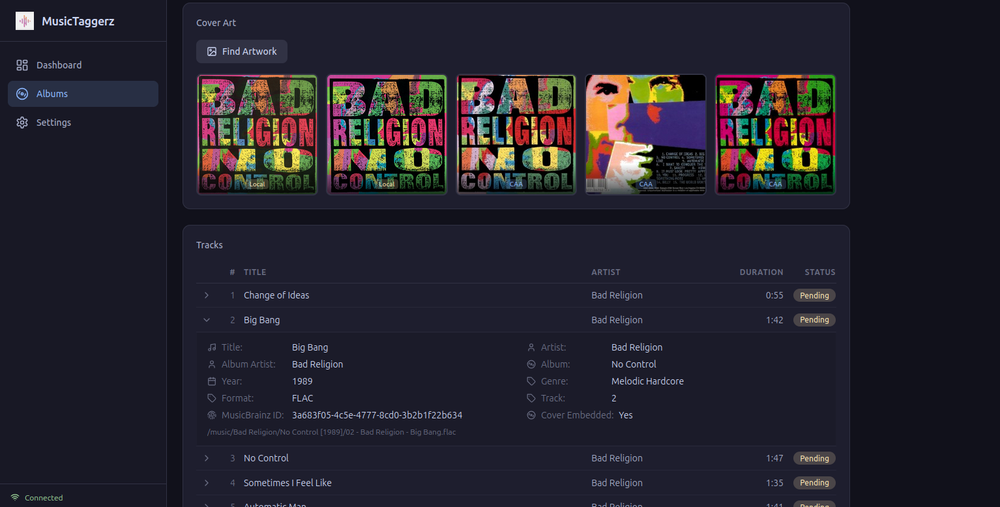
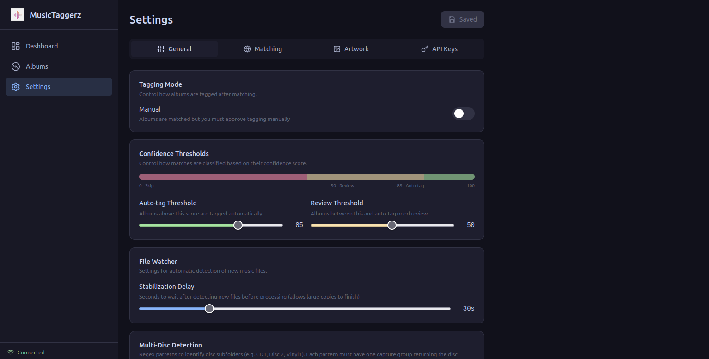

<p align="center">
  
</p>

<h1 align="center">MusicTaggerz</h1>

<p align="center">
  <strong>Automatic music tagger with MusicBrainz integration.</strong><br/>
  Scans your library, matches albums, writes tags. Docker-ready for Unraid.
</p>

<p align="center">
  
  
  
  
</p>

---

## Screenshots

<p align="center">
  
</p>
<p align="center"><em>Dashboard — overview of your library with status breakdown and recent activity</em></p>

<p align="center">
  
</p>
<p align="center"><em>Albums — browse your library with cover art, search and status filters</em></p>

<p align="center">
  
</p>
<p align="center"><em>Album Detail — review match candidates with confidence scores, tag or skip</em></p>

<p align="center">
  
</p>
<p align="center"><em>Tracks & Artwork — track list with cover art chooser from multiple sources</em></p>

<p align="center">
  
</p>
<p align="center"><em>Settings — thresholds, file watcher, multi-disc patterns, artwork sources, API keys</em></p>

---

## Features

| | |
|---|---|
| **Smart Matching** | Searches MusicBrainz by text (artist + album), ignoring potentially wrong embedded IDs |
| **Scoring Algorithm** | Rates candidates 0-100 based on text similarity, track count, durations, media, country, year |
| **Auto-Decisions** | Auto-tags high confidence matches, queues uncertain ones for manual review |
| **Multi-Format** | Reads and writes tags for FLAC, MP3, M4A, OGG, Opus, WMA |
| **HD Artwork** | Fetches covers from iTunes, fanart.tv, Spotify, Cover Art Archive (up to 1400px) |
| **File Watcher** | Auto-detects new albums via inotify with configurable stabilization delay |
| **Multi-Disc** | Detects disc subfolders (CD1, Vinyl2, Cassette1, Side A...) and merges into a single album |
| **Web UI** | Modern dark dashboard with React + TailwindCSS + real-time WebSocket updates |
| **In-Place Tagging** | Never moves or renames files, only writes tags |

---

## Quick Start

### Docker (recommended)

```bash
docker build -t musictaggerz .
docker run -d \
  --name musictaggerz \
  -p 8765:8765 \
  -v /path/to/music:/music \
  -v musictaggerz_data:/data \
  musictaggerz
```

Then open **http://localhost:8765**.

### Development

```bash
# Backend
cd backend
pip install -r requirements.txt
MUSIC_DIR=/path/to/music uvicorn app.main:app --port 8765 --reload

# Frontend
cd frontend
npm install
npm run dev
```

---

## Tech Stack

| Layer | Technology |
|---|---|
| Backend | Python 3.11, FastAPI, SQLAlchemy, SQLite |
| Audio | Mutagen (tags), AcoustID (fingerprinting) |
| Matching | MusicBrainz via musicbrainzngs |
| File Watcher | Watchdog (inotify) |
| Frontend | React 18, TypeScript, Vite, TailwindCSS, Zustand |
| Realtime | WebSocket (album updates, progress, notifications) |
| Container | Docker multi-stage build |

---

## Configuration

All settings are configurable from the web UI under **Settings**. They can also be set as environment variables:

| Variable | Default | Description |
|---|---|---|
| `MUSIC_DIR` | `/music` | Path to music library |
| `DATABASE_URL` | `sqlite:////data/autotagger.db` | Database path |
| `LOG_LEVEL` | `INFO` | Logging level |
| `CONFIDENCE_AUTO_THRESHOLD` | `85` | Auto-tag above this score |
| `CONFIDENCE_REVIEW_THRESHOLD` | `50` | Queue for review above this |
| `ARTWORK_SOURCES` | `coverart,filesystem,itunes,...` | Artwork source priority |
| `FANARTTV_API_KEY` | | fanart.tv API key (optional) |
| `SPOTIFY_CLIENT_ID` | | Spotify client ID (optional) |

---

## How Matching Works

```
Scan folder  -->  Search MusicBrainz by artist + album text
                           |
                  Score each candidate (0-100)
                   - Text similarity    30 pts
                   - Track count        20 pts
                   - Duration match     20 pts
                   - Preferred media    10 pts
                   - Preferred country  10 pts
                   - Year match         10 pts
                   - Multi-disc penalty -15 pts
                           |
              >= 85: auto-tag    50-84: review    < 50: skip
```

---

## API

| Method | Endpoint | Description |
|---|---|---|
| `GET` | `/api/albums` | List albums (filters, pagination, search) |
| `GET` | `/api/albums/{id}` | Album detail with tracks and candidates |
| `POST` | `/api/albums/{id}/tag` | Tag album with best or specific release |
| `POST` | `/api/albums/{id}/skip` | Skip album |
| `POST` | `/api/scan` | Trigger directory scan |
| `GET` | `/api/albums/{id}/cover` | Serve album cover art |
| `GET` | `/api/stats` | Dashboard statistics |
| `GET/PUT` | `/api/settings` | Read / update settings |
| `WS` | `/ws` | Real-time updates |

---

## License

MIT
